# Plotting MCMC draws using the bayesplot package

## Introduction

This vignette focuses on plotting parameter estimates from MCMC draws.
MCMC diagnostic plots are covered in the separate vignette [*Visual MCMC
diagnostics*](https://mc-stan.org/bayesplot/articles/visual-mcmc-diagnostics.html),
and graphical posterior predictive model checking is covered in the
vignette [*Graphical posterior predictive
checks*](https://mc-stan.org/bayesplot/articles/graphical-ppcs.html).

### Setup

In addition to **bayesplot** we’ll load the following packages:

- **ggplot2**, in case we want to customize the ggplot objects created
  by **bayesplot**
- **rstanarm**, for fitting the example models used throughout the
  vignette

``` r
library("bayesplot")
library("ggplot2")
library("rstanarm")      
```

### Example model

The **bayesplot** package provides various plotting functions for
visualizing Markov chain Monte Carlo (MCMC) draws from the posterior
distribution of the parameters of a Bayesian model. In this vignette we
demonstrate a few of these functions. Example usage of the functions not
demonstrated here can be found in the package documentation.

For demonstration we will use draws obtained using the `stan_glm`
function in the **rstanarm** package (Gabry and Goodrich, 2017), but
MCMC draws from using any package can be used with the functions in the
**bayesplot** package. See, for example, **brms**, which, like
**rstanarm**, calls the **rstan** package internally to use
[Stan](https://mc-stan.org/)’s MCMC sampler.

``` r
head(mtcars) # see help("mtcars")
```

                       mpg cyl disp  hp drat    wt  qsec vs am gear carb
    Mazda RX4         21.0   6  160 110 3.90 2.620 16.46  0  1    4    4
    Mazda RX4 Wag     21.0   6  160 110 3.90 2.875 17.02  0  1    4    4
    Datsun 710        22.8   4  108  93 3.85 2.320 18.61  1  1    4    1
    Hornet 4 Drive    21.4   6  258 110 3.08 3.215 19.44  1  0    3    1
    Hornet Sportabout 18.7   8  360 175 3.15 3.440 17.02  0  0    3    2
    Valiant           18.1   6  225 105 2.76 3.460 20.22  1  0    3    1

``` r
# linear regression model using stan_glm
# using '~ .' to include all variables
fit <- stan_glm(mpg ~ ., data = mtcars, seed = 1111)
print(fit)
```

    stan_glm
     family:       gaussian [identity]
     formula:      mpg ~ .
     observations: 32
     predictors:   11
    ------
                Median MAD_SD
    (Intercept) 12.0   19.3  
    cyl         -0.1    1.1  
    disp         0.0    0.0  
    hp           0.0    0.0  
    drat         0.8    1.6  
    wt          -3.7    1.9  
    qsec         0.8    0.8  
    vs           0.3    2.1  
    am           2.6    2.1  
    gear         0.6    1.5  
    carb        -0.2    0.9  

    Auxiliary parameter(s):
          Median MAD_SD
    sigma 2.7    0.4   

    ------
    * For help interpreting the printed output see ?print.stanreg
    * For info on the priors used see ?prior_summary.stanreg

To use the posterior draws with the functions in the **bayesplot**
package we’ll extract them from the fitted model object:

``` r
posterior <- as.array(fit)
dim(posterior)
```

    [1] 1000    4   12

``` r
dimnames(posterior)
```

    $iterations
    NULL

    $chains
    [1] "chain:1" "chain:2" "chain:3" "chain:4"

    $parameters
     [1] "(Intercept)" "cyl"         "disp"        "hp"          "drat"       
     [6] "wt"          "qsec"        "vs"          "am"          "gear"       
    [11] "carb"        "sigma"      

We’ve used `as.array` above (as opposed to `as.matrix`) because it keeps
the Markov chains separate (`stan_glm` runs four chains by default).
Most of the plots don’t actually need the chains to be separate, but for
a few of the plots we make in this vignette we’ll want to show the
chains individually.

  

## Posterior uncertainty intervals

For models fit using MCMC we can compute posterior uncertainty intervals
(sometimes called “credible intervals”) in various ways. **bayesplot**
currently provides plots of central intervals based on quantiles,
although additional options may be provided in future releases (e.g.,
HDIs, which can be useful in particular cases).

**Documentation:**

- [`help("MCMC-intervals")`](https://mc-stan.org/bayesplot/reference/MCMC-intervals.md)
- [mc-stan.org/bayesplot/reference/MCMC-intervals](https://mc-stan.org/bayesplot/reference/MCMC-intervals.html)

------------------------------------------------------------------------

#### mcmc_intervals, mcmc_areas

Central posterior uncertainty intervals can be plotted using the
`mcmc_intervals` function.

``` r
color_scheme_set("red")
mcmc_intervals(posterior, pars = c("cyl", "drat", "am", "sigma"))
```

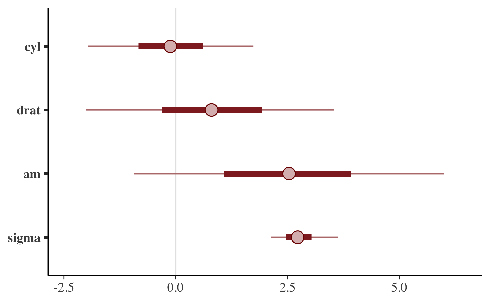

The default is to show 50% intervals (the thick segments) and 90%
intervals (the thinner outer lines). These defaults can be changed using
the `prob` and `prob_outer` arguments, respectively. The points in the
above plot are posterior medians. The `point_est` argument can be used
to select posterior means instead or to omit the point estimates.

To show the uncertainty intervals as shaded areas under the estimated
posterior density curves we can use the `mcmc_areas` function.

``` r
mcmc_areas(
  posterior, 
  pars = c("cyl", "drat", "am", "sigma"),
  prob = 0.8, # 80% intervals
  prob_outer = 0.99, # 99%
  point_est = "mean"
)
```

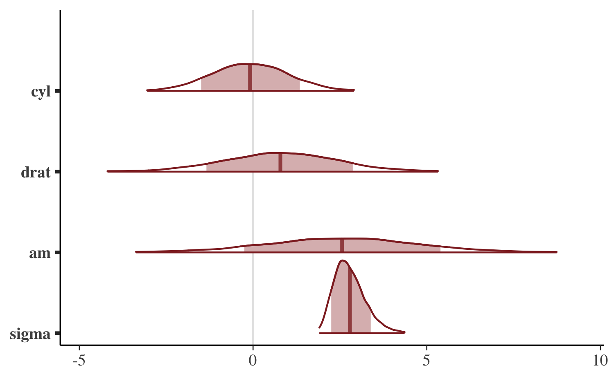

  

## Univariate marginal posterior distributions

**bayesplot** provides functions for looking at histograms or kernel
density estimates of marginal posterior distributions, either with all
Markov chains combined or with the chains separate.

**Documentation:**

- [`help("MCMC-distributions")`](https://mc-stan.org/bayesplot/reference/MCMC-distributions.md)
- [mc-stan.org/bayesplot/reference/MCMC-distributions](https://mc-stan.org/bayesplot/reference/MCMC-distributions.html)

------------------------------------------------------------------------

#### mcmc_hist

The `mcmc_hist` function plots marginal posterior distributions
(combining all chains):

``` r
color_scheme_set("green")
mcmc_hist(posterior, pars = c("wt", "sigma"))
```

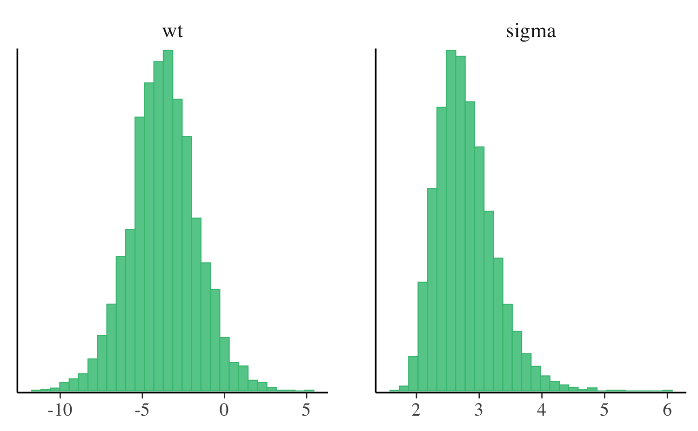

If we want to plot `log(sigma)` rather than `sigma` we can either
transform the draws in advance or use the `transformations` argument.

``` r
color_scheme_set("blue")
mcmc_hist(posterior, pars = c("wt", "sigma"),
          transformations = list("sigma" = "log"))
```

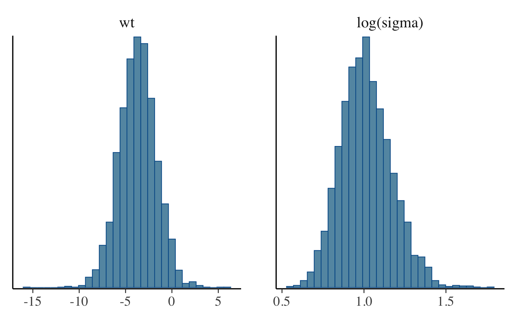

Most of the other functions for plotting MCMC draws also have a
`transformations` argument.

#### mcmc_hist_by_chain

To view separate histograms of each of the four Markov chains we can use
`mcmc_hist_by_chain`, which plots each chain in a separate facet in the
plot.

``` r
color_scheme_set("brightblue")
mcmc_hist_by_chain(posterior, pars = c("wt", "sigma"))
```

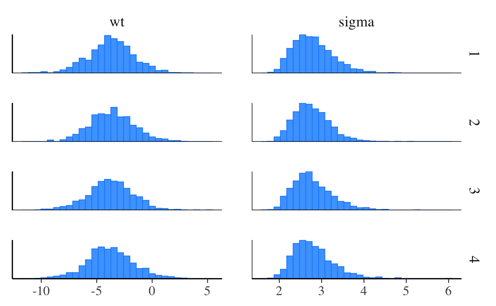

#### mcmc_dens

The `mcmc_dens` function is similar to `mcmc_hist` but plots kernel
density estimates instead of histograms.

``` r
color_scheme_set("purple")
mcmc_dens(posterior, pars = c("wt", "sigma"))
```

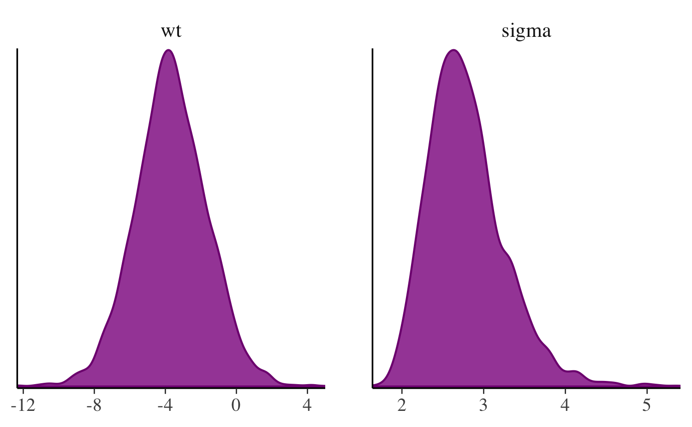

#### mcmc_dens_overlay

Like `mcmc_hist_by_chain`, the `mcmc_dens_overlay` function separates
the Markov chains. But instead of plotting each chain individually, the
density estimates are overlaid.

``` r
mcmc_dens_overlay(posterior, pars = c("wt", "sigma"))
```

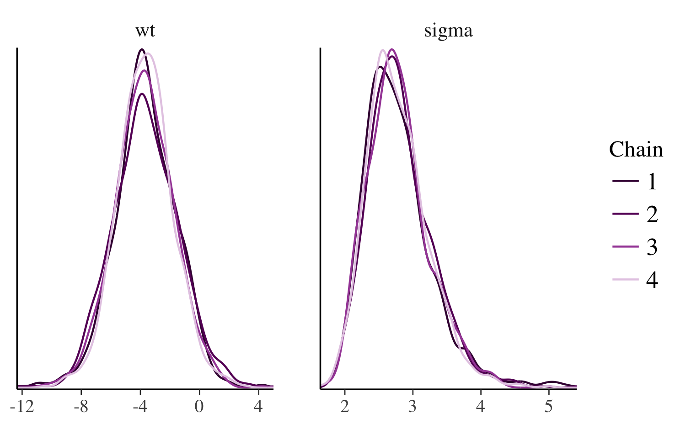

#### mcmc_violin

The `mcmc_violin` function plots the density estimates of each chain as
violins and draws horizontal line segments at user-specified quantiles.

``` r
color_scheme_set("teal")
mcmc_violin(posterior, pars = c("wt", "sigma"), probs = c(0.1, 0.5, 0.9))
```

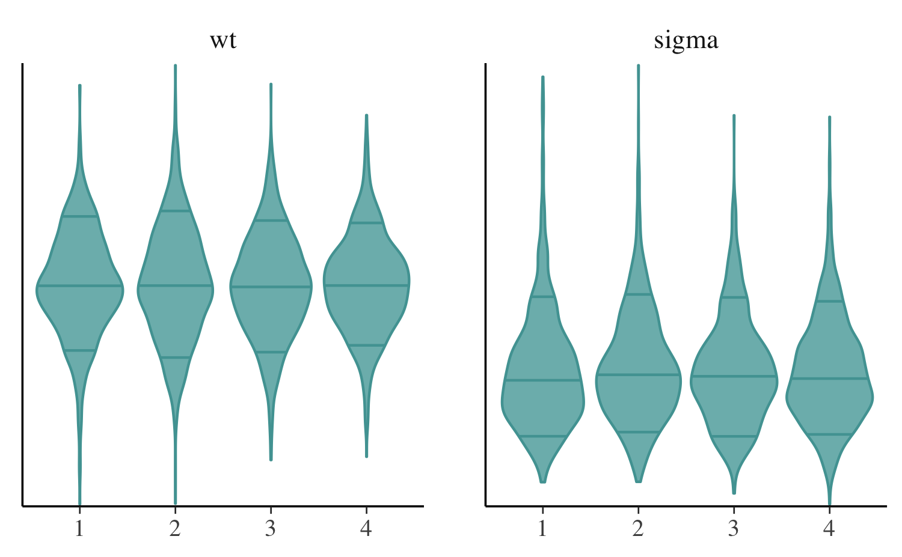

  

## Bivariate plots

Various functions are available for plotting bivariate marginal
posterior distributions. Some of these functions also take optional
arguments for adding MCMC diagnostic information to the plots. That
additional functionality is discussed in the separate [*Visual MCMC
diagnostics*](https://mc-stan.org/bayesplot/articles/visual-mcmc-diagnostics.html)
vignette.

**Documentation:**

- [`help("MCMC-scatterplots")`](https://mc-stan.org/bayesplot/reference/MCMC-scatterplots.md)
- [mc-stan.org/bayesplot/reference/MCMC-scatterplots](https://mc-stan.org/bayesplot/reference/MCMC-scatterplots.html)

------------------------------------------------------------------------

#### mcmc_scatter

The `mcmc_scatter` function creates a simple scatterplot of two
parameters.

``` r
color_scheme_set("gray")
mcmc_scatter(posterior, pars = c("(Intercept)", "wt"), 
             size = 1.5, alpha = 0.5)
```

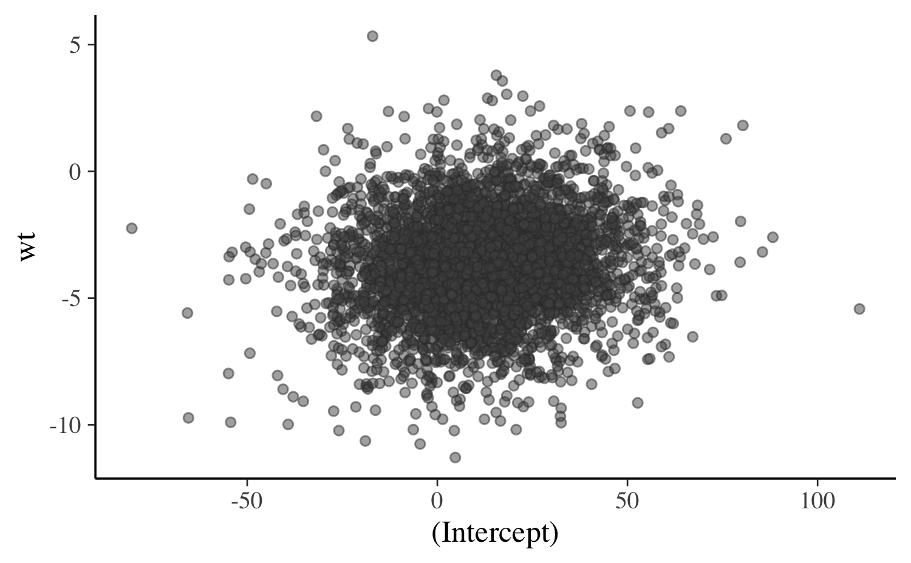

#### mcmc_hex

The `mcmc_hex` function creates a similar plot but using hexagonal
binning, which can be useful to avoid overplotting.

``` r
# requires hexbin package
if (requireNamespace("hexbin", quietly = TRUE)) {
  mcmc_hex(posterior, pars = c("(Intercept)", "wt"))
}
```

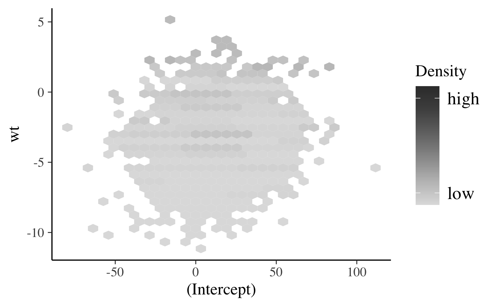

#### mcmc_pairs

In addition to `mcmc_scatter` and `mcmc_hex`, **bayesplot** now provides
an `mcmc_pairs` function for creating pairs plots with more than two
parameters.

``` r
color_scheme_set("pink")
mcmc_pairs(posterior, pars = c("(Intercept)", "wt", "sigma"),
           off_diag_args = list(size = 1.5))
```

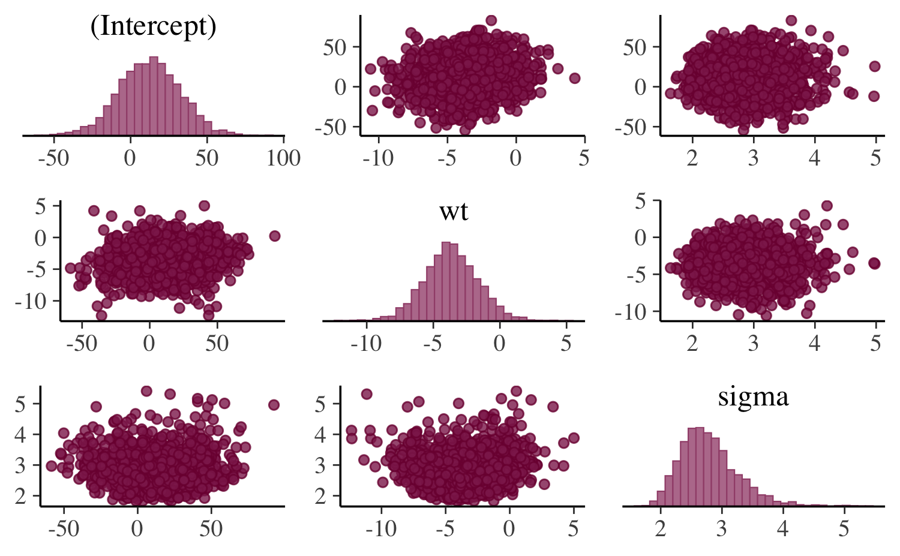

The univariate marginal posteriors are shown along the diagonal as
histograms, but this can be changed to densities by setting
`diag_fun="dens"`. Bivariate plots are displayed above and below the
diagonal as scatterplots, but it is also possible to use hex plots by
setting `off_diag_fun="hex"`. By default, `mcmc_pairs` shows some of the
Markov chains (half, if an even number of chains) above the diagonal and
the others below. There are many more options for controlling how the
draws should be split between the plots above and below the diagonal
(see the documentation for the `condition` argument), but they are more
useful when MCMC diagnostic information is included. This is discussed
in the [*Visual MCMC
diagnostics*](https://mc-stan.org/bayesplot/articles/visual-mcmc-diagnostics.html)
vignette.

  

## Trace plots

Trace plots are time series plots of Markov chains. In this vignette we
show the standard trace plots that **bayesplot** can make. For models
fit using any Stan interface (or Hamiltonian Monte Carlo in general),
the [*Visual MCMC
diagnostics*](https://mc-stan.org/bayesplot/articles/visual-mcmc-diagnostics.html)
vignette provides an example of also adding information about
divergences to trace plots.

**Documentation:**

- [`help("MCMC-traces")`](https://mc-stan.org/bayesplot/reference/MCMC-traces.md)
- [mc-stan.org/bayesplot/reference/MCMC-traces](https://mc-stan.org/bayesplot/reference/MCMC-traces.html)

------------------------------------------------------------------------

#### mcmc_trace

The `mcmc_trace` function creates standard trace plots:

``` r
color_scheme_set("blue")
mcmc_trace(posterior, pars = c("wt", "sigma"))
```

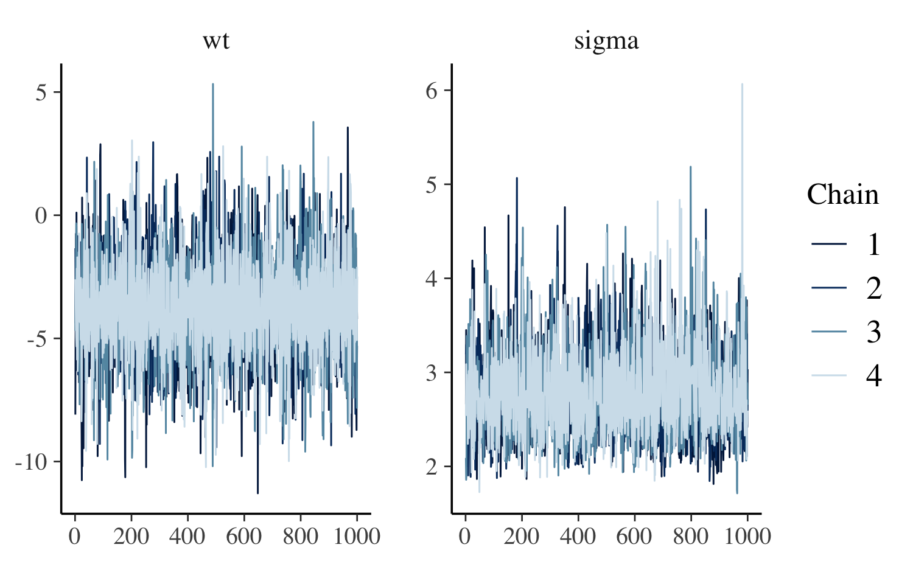

If it’s hard to see the difference between the chains we can change to a
mixed color scheme, for example:

``` r
color_scheme_set("mix-blue-red")
mcmc_trace(posterior, pars = c("wt", "sigma"), 
           facet_args = list(ncol = 1, strip.position = "left"))
```

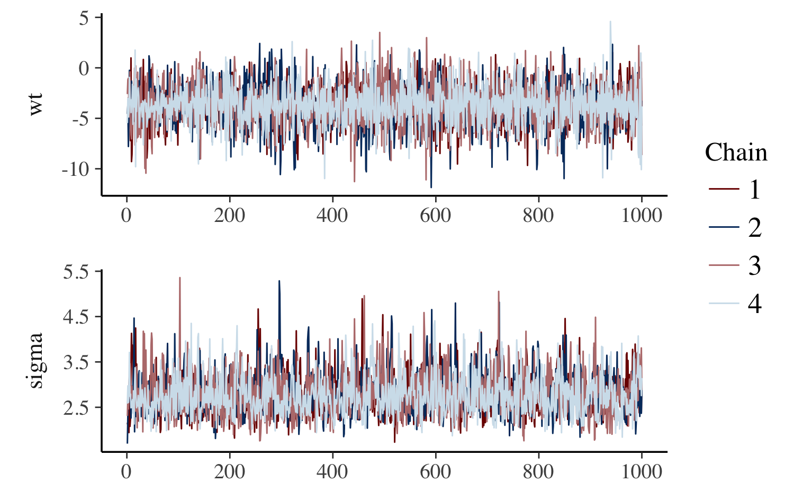

The code above also illustrates the use of the `facet_args` argument,
which is a list of parameters passed to `facet_wrap` in **ggplot2**.
Specifying `ncol=1` means the trace plots will be stacked in a single
column rather than placed side by side, and `strip.position="left"`
moves the facet labels to the y-axis (instead of above each facet).

The [`"viridis"` color
scheme](https://CRAN.R-project.org/package=viridis) is also useful for
trace plots because it is comprised of very distinct colors:

``` r
color_scheme_set("viridis")
mcmc_trace(posterior, pars = "(Intercept)")
```

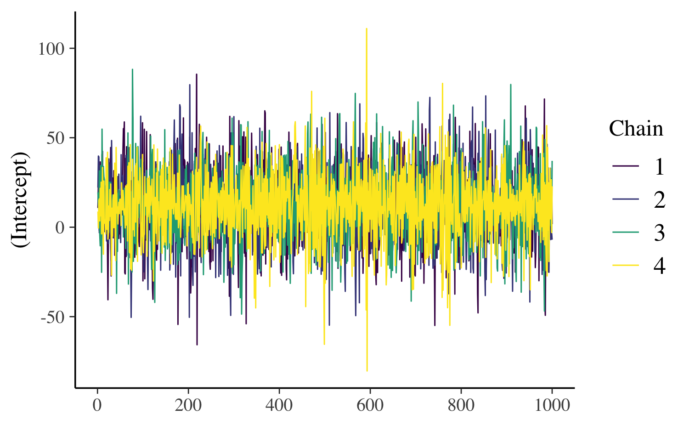

#### mcmc_trace_highlight

The `mcmc_trace_highlight` function uses points instead of lines and
reduces the opacity of all but a single chain (which is specified using
the `highlight` argument).

``` r
mcmc_trace_highlight(posterior, pars = "sigma", highlight = 3)
```


  

## References

Gabry, J., and Goodrich, B. (2017). rstanarm: Bayesian Applied
Regression Modeling via Stan. R package version 2.15.3.
<https://mc-stan.org/rstanarm/>,
<https://CRAN.R-project.org/package=rstanarm>

Gabry, J., Simpson, D., Vehtari, A., Betancourt, M. and Gelman, A.
(2019), Visualization in Bayesian workflow. *J. R. Stat. Soc. A*, 182:
389-402. :10.1111/rssa.12378. ([journal
version](https://rss.onlinelibrary.wiley.com/doi/full/10.1111/rssa.12378),
[arXiv preprint](https://arxiv.org/abs/1709.01449), [code on
GitHub](https://github.com/jgabry/bayes-vis-paper))

Gelman, A., Carlin, J. B., Stern, H. S., Dunson, D. B., Vehtari, A., and
Rubin, D. B. (2013). *Bayesian Data Analysis*. Chapman & Hall/CRC Press,
London, third edition.

Stan Development Team. (2017). *Stan Modeling Language Users Guide and
Reference Manual*. <https://mc-stan.org/users/documentation/>
