# Model checking using 'ppc_pit_ecdf' and 'ppc_loo_pit_ecdf'

## Setup

``` r

library(bayesplot)
library(ggplot2)
library(patchwork)
library(loo)

set.seed(2026)
```

## Introduction

This vignette focuses on pointwise predictive checks based on the
probability integral transform (PIT). The PIT is defined as the model’s
univariate predictive cumulative distribution function (CDF) evaluated
at the observed data. For a well-calibrated model, these transformations
result in values that should be approximately uniformly distributed
between 0 and 1 (Tesso & Vehtari, [2026](#Tesso2026); Säilynoja et al.,
[2022](#S%C3%A4ilynoja2022)).

In `bayesplot`, PIT-based checks are implemented in the
[`ppc_pit_ecdf()`](https://mc-stan.org/bayesplot/dev/reference/PPC-distributions.md)
and
[`ppc_loo_pit_ecdf()`](https://mc-stan.org/bayesplot/dev/reference/PPC-loo.md)
functions, which plot the empirical CDF of the PIT values against the
expected uniform distribution. The
[`ppc_pit_ecdf_grouped()`](https://mc-stan.org/bayesplot/dev/reference/PPC-distributions.md)
function extends this functionality to allow for grouping by covariates.

**New Correlation-Aware Method**

Following the work of Tesso & Vehtari ([2026](#Tesso2026)), `bayesplot`
now offers a new method for evaluating the uniformity of PIT values that
accounts for their correlation structure. This method is implemented via
the argument `method = "correlated"` and is recommended for most
applications. The previous approach is retained via
`method = "independent"` for backward compatibility and is the current
default to simplfy transition for the user.

This vignette focuses specifically on the changes introduced by the new
correlation-aware method. For background information on graphical
uniformity tests using PIT, see Säilynoja et
al. ([2022](#S%C3%A4ilynoja2022)). For a more general discussion on the
use of Leave-One-Out Cross-Validation (LOO-CV), see Vehtari et
al. ([2017](#Vehtari2017), [2024](#Vehtari2024)), among others.

## Reading the plots for different (mis)calibration scenarios

The shape of the ECDF curve provides direct insight into *how* a
predictive distribution is miscalibrated. To illustrate this, the
following examples utilize simulated scenarios where “observed” values
(`y`) are drawn from a `normal(0, sd)` distribution, while “replicated”
values (`yrep`) are generated from a non-central t-distribution. By
varying the degrees of freedom (`df`) and non-centrality parameter
(`ncp`), we can simulate and visualize several distinct types of
miscalibration.

### Calibrated model

We begin by simulating a well-calibrated scenario where the predictive
distribution (`ypred`) closely matches the data-generating process
(`y`). In this case, the PIT values should be approximately uniform, and
the ECDF should closely follow the identity (diagonal) line.

\\ \begin{align\*} y &\sim \text{Normal}(0, 1) \\ y\_{rep} &\sim
\text{Student}\_{\nu = 100}(0, 1) \quad (\approx \text{Normal}(0, 1))
\end{align\*} \\

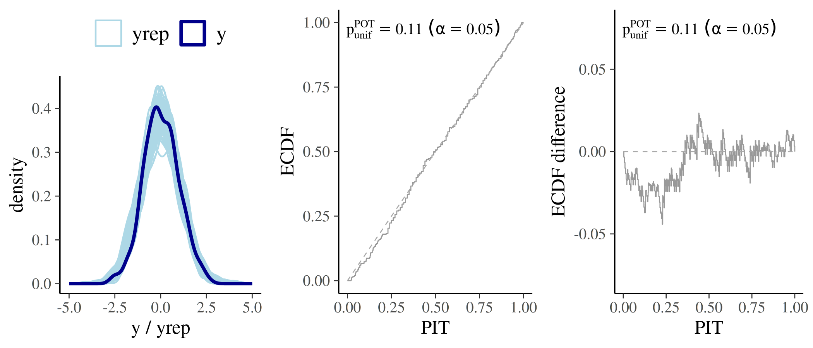

### Predictive distribution too wide (overdispersed)

When the predictive distribution is too wide, the model overestimates
the probability mass in the tails. As a result, observed values tend to
fall near the *centre* of the predictive distribution more often than
expected. This leads to an `S`-shaped ECDF curve that typically falls
below the diagonal line in the lower tail and rises above it in the
upper tail.

\\ \begin{aligned} y &\sim \text{Normal}(0, 1) \\ y\_{rep} &\sim
\text{Student}\_{\nu = 1}(0, 1) \quad (= \text{Cauchy}(0, 1))
\end{aligned} \\

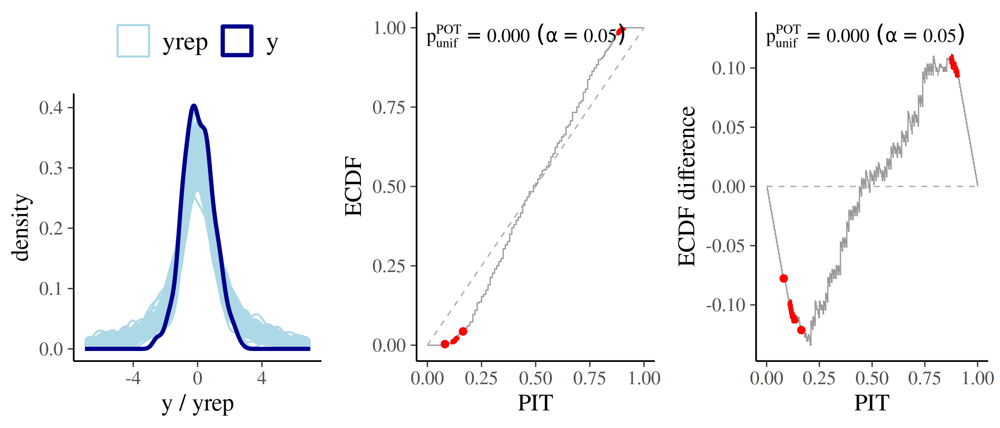

### Predictive distribution too narrow (underdispersed)

When the predictive distribution is too narrow, the model underestimates
the potential for extreme values, causing observations to fall
frequently in the tails. This results in a reverse `S`-shaped ECDF curve
that typically lies above the diagonal line in the lower tail and below
it in the upper tail.

\\ \begin{aligned} y &\sim \text{Normal}(0, 2) \\ y\_{rep} &\sim
\text{Student}\_{\nu = 100}(0, 1) \quad (\approx \text{Normal}(0, 1))
\end{aligned} \\

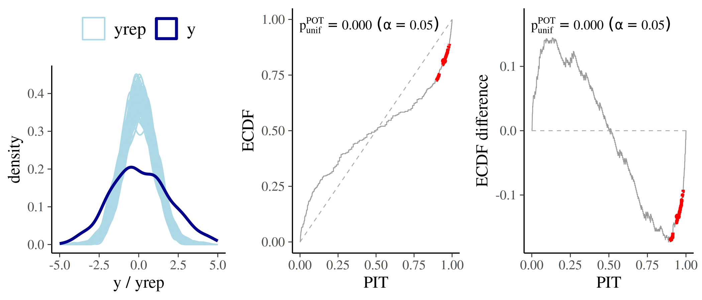

### Systematically biased predictions (location shift)

When the model’s predictions are systematically shifted relative to the
data, observations tend to fall consistently in one tail of the
predictive distribution. This results in an ECDF curve that “bows” aways
from the identity line:

- Underestimation (Positive Bias): If the model predicts values that are
  systematically too low, the PIT values will cluster near 1. The ECDF
  curve will stay below the diagonal line.
- Overestimation (Negative Bias): If the model predicts values that are
  systematically too high, the PIT values will cluster near 0. The ECDF
  curve will stay above the diagonal line.

\\ \begin{aligned} y &\sim \text{Normal}(0, 1) \\ y\_{rep} &\sim
\text{Student}\_{\nu = 100}(-1, 1) \end{aligned} \\

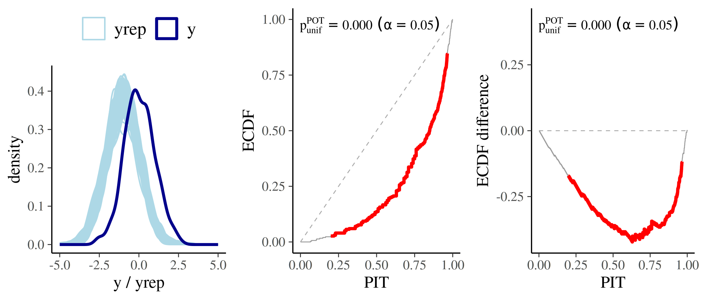

## The `method` argument

### `method = "independent"` (superseded)

When `method = "independent"` is selected, simultaneous confidence bands
for the ECDF are constructed under the assumption that the PIT values
are both independent and uniform (Säilynoja et al.,
[2022](#S%C3%A4ilynoja2022)). However, if this independence assumption
is violated, the resulting bands can be too wide, which reduces the
test’s sensitivity to actual miscalibration (Tesso & Vehtari,
[2026](#Tesso2026)).

**Deprecation and Compatibility**

As of `bayesplot v1.16.0`, the `"independent"` method is officially
superseded. But it will remain the default method for the time being to
simplify the transition for users. If no method is specified,
`"independent"` will be used and a message will be printed informing the
user:

    ℹ In the next major release, the default `method` will change to 'correlated'.
    • To silence this message, explicitly set `method = 'independent'` or
      `method = 'correlated'`.

If `"independent"` is explicitly set, it will trigger a message
informing the user:

    "The 'independent' method is superseded by the 'correlated' method."

This is intended to encourage a transition to the `"correlated"` method,
which will become the default in a future release.

### `method = "correlated"` (new, recommended)

This method employes one of three dependence-aware uniformity tests
(selected via the `test` argument; details below) to compute a global
p-value for the null hypothesis of uniformity. Unlike the independent
method, it accounts for the correlation among PIT values (Tesso &
Vehtari, [2026](#Tesso2026)).

Instead of drawing traditional confidence bands, the plot highlights
ECDF regions in red where the pointwise contribution to the test
statistic is largest. This visualization makes it easier to diagnose the
*type* and *location* of miscalibration.

``` r

set.seed(2026)
pit <- rbeta(300, 1, 1.2)

p1 <- ppc_loo_pit_ecdf(
  pit = pit,
  method = "independent"
  ) +
  labs(subtitle = "method = 'independent'")

p2 <- ppc_loo_pit_ecdf(
  pit = pit, method = "correlated"
  ) +
  labs(subtitle = "method = 'correlated'")

p1 | p2
```

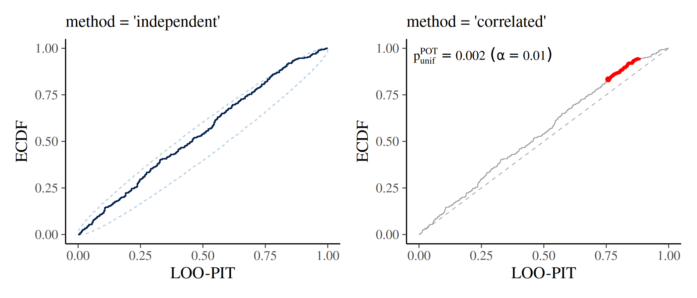

## The three uniformity-tests within `method = "correlated"`

When using `method = "correlated"`, you select the testing procedure via
the `test` argument. The three options correspond to the three
procedures proposed by Tesso & Vehtari ([2026](#Tesso2026)):

### `test = "POT"`

Pointwise Order Tests Combination (`POT`) is based on order statistics
of the PIT values and is the **recommended default** for most workflows.
It should ideally use continuous LOO-PITs and works for PSIS-LOO
weighted rank-based PITs.

### `test = "PRIT"`

Pointwise Rank-based Individual Tests Combination (`PRIT`) is designed
for **rank-based or discrete PIT values**. It is most compatible with
PITs computed as normalized ranks and is weaker than “POT” in testing
weighted rank based LOO-PIT values for the same reason previously
outlined.

### `test = "PIET"`

Pointwise Inverse-CDF Evaluation Tests Combination (`PIET`) applies an
inverse-CDF transformation before testing and is **tail-sensitive**. It
is exclusively recommended for detecting deviations in tails (or
outliers) and requires continuous PIT values for reliable behavior.

## Additional arguments

With the introduction of the `method = "correlated"` option, the three
functions now have additional arguments that control the appearance and
behavior of the plot when using correlated testing procedures. These
arguments are:

### `gamma`

When `method = "correlated"` and the global test rejects uniformity, the
plot uses color coding to highlight influential regions. The `gamma`
argument is a non-negative numeric threshold: a point is highlighted if
its pointwise contribution to the test statistic exceeds `gamma`. The
default is `0`, which highlights all points that contribute at all when
the test rejects. Increasing `gamma` raises the bar, flagging only the
most strongly deviant points.

``` r

set.seed(2026)
pit <- rbeta(300, 1, 1.2)

# Highlight only the most strongly influential regions
p1 <- ppc_loo_pit_ecdf(
  pit = pit,
  method = "correlated",
  plot_diff = TRUE,
  gamma = 0
  ) +
    labs(subtitle = "gamma = 0")

# Highlight more broadly
p2 <- ppc_loo_pit_ecdf(
  pit = pit, method = "correlated",
  plot_diff = TRUE,
  gamma = 80
  ) +
  labs(subtitle = "gamma = 80")

p1 | p2
```

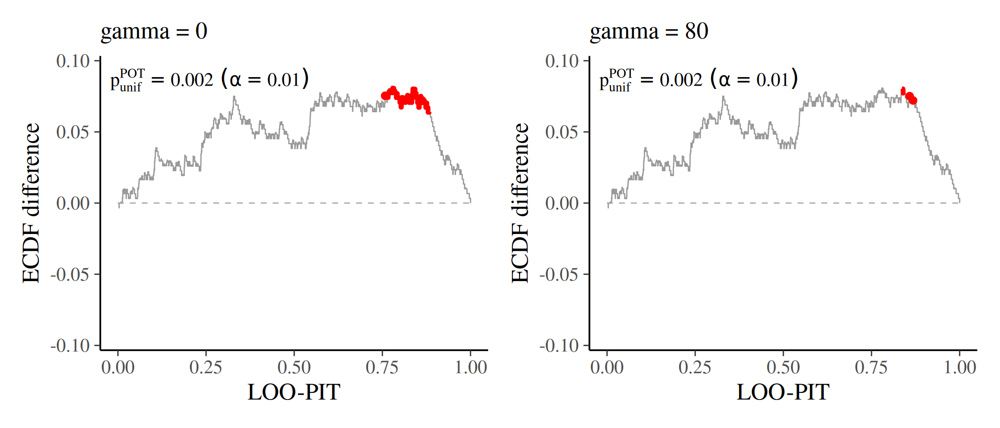

### `linewidth` and `color`

`linewidth` controls the width of the ECDF line (default `0.3`). `color`
is a named character vector with two elements controlling the appearance
of the plot: `c(ecdf = "grey60", highlight = "red")`. Whereby `ecdf` is
the color of the main ECDF line; `highlight` is the color used for the
flagged regions when the global test rejects. Both can be overridden:

``` r

pit <- rbeta(300, 2, 2)

p1 <- ppc_loo_pit_ecdf(
  pit = pit,
  method = "correlated"
) +
  labs(subtitle = "default style")

p2 <- ppc_loo_pit_ecdf(
  pit = pit,
  method = "correlated",
  color = c(ecdf = "steelblue", highlight = "orange"),
  linewidth = 0.5
) +
  labs(subtitle = "custom color / linewidth")

p1 | p2
```

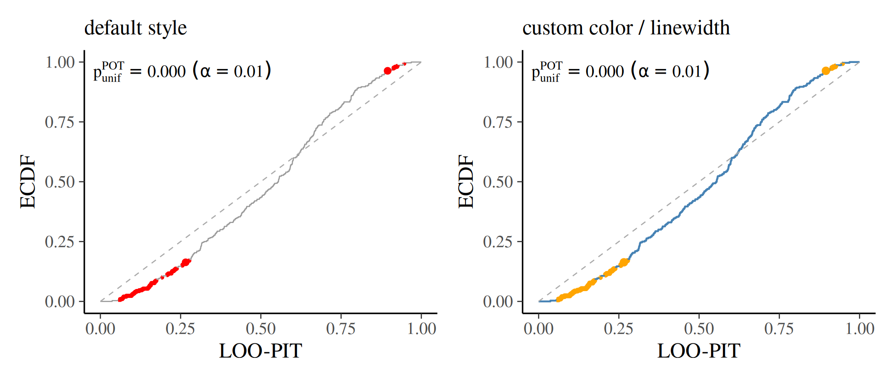

### `help_text`

Setting `help_text = TRUE` adds an annotation to the plot showing the
`test` name, (1-`prob`) level (\\\alpha\\), and global p-value. This is
the **default** (`help_text = TRUE`). Set `help_text = FALSE` to
suppress the annotation.

``` r

pit <- rbeta(300, 1, 1.2)

p1 <- ppc_loo_pit_ecdf(
  pit = pit,
  method = "correlated",
  plot_diff = TRUE,
  help_text = TRUE
) +
  labs(subtitle = "help_text = TRUE")

p2 <- ppc_loo_pit_ecdf(
  pit = pit,
  method = "correlated",
  plot_diff = TRUE,
  help_text = FALSE
) +
  labs(subtitle = "help_text = FALSE")

p1 | p2
```

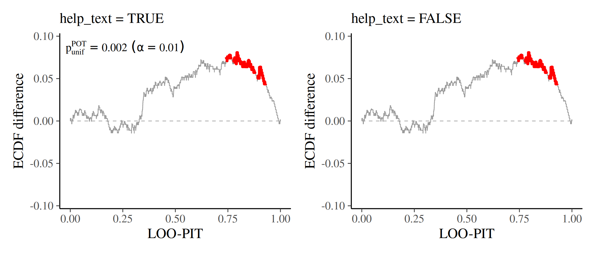

### `help_text_shrinkage`

When `help_text = TRUE`, `help_text_shrinkage` controls the relative
size of the annotation. It is a numeric factor in \\(0, 1\]\\ (default
`0.8`) multiplied by the theme text size. Decrease it to shrink crowded
annotations (especially in faceted / grouped plots); increase it toward
`1` for larger labels.

``` r

pit <- rbeta(300, 1, 1.2)

p1 <- ppc_loo_pit_ecdf(
  pit = pit,
  method = "correlated",
  plot_diff = TRUE,
  help_text_shrinkage = 0.5
) +
  labs(subtitle = "help_text_shrinkage = 0.5")

p2 <- ppc_loo_pit_ecdf(
  pit = pit,
  method = "correlated",
  plot_diff = TRUE,
  help_text_shrinkage = 1
) +
  labs(subtitle = "help_text_shrinkage = 1")

p1 | p2
```

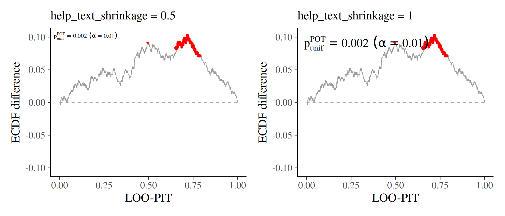

### `pareto_pit`

The `pareto_pit` argument controls how PIT values are computed
internally when precomputed `pit` values are not supplied. It follows
the standard PIT computation procedure, except that in the tails it
substitutes the empirical CDF (ECDF) with the CDF of a fitted
generalized Pareto distribution. This reduces variability and yields
non-zero, non-unity PIT values even outside the range of the reference
draws — making it particularly useful for stabilizing PIT uniformity
checks, where a single 0 or 1 can otherwise introduce large variation.

The following figure compares simulated PIT values from
[`rstantools::loo_pit()`](https://mc-stan.org/rstantools/reference/loo-prediction.html)
(x-axis) with those from
[`posterior::pareto_pit()`](https://mc-stan.org/posterior/reference/pareto_pit.html)
(y-axis). Both axes are logit-transformed, so PIT values of exactly 0 or
1 map to `-Inf` or `Inf`, respectively; these are shown as red bars on
the left (for 0) and right (for 1) edge of the y-axis. The plot
illustrates how `pareto_pit` replaces these extreme values with finite,
less extreme alternatives, thereby reducing variability.

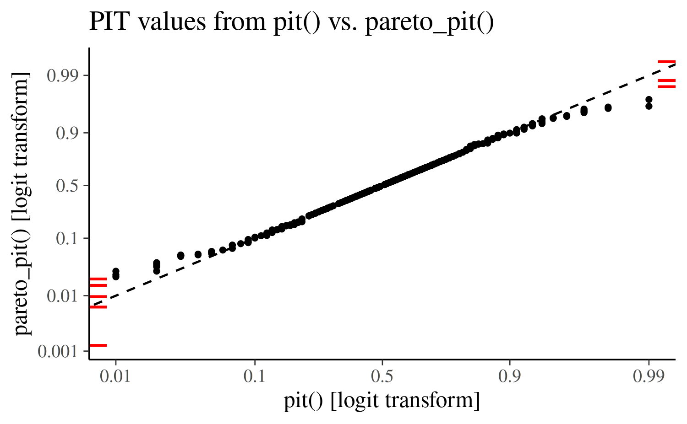

**Default behavior (recommended):** leave `pareto_pit` at its default
value. The function chooses the appropriate PIT computation
automatically based on `method` and `test`:

| method          |   test   | `pareto_pit` default               |
|:----------------|:--------:|:-----------------------------------|
| `"independent"` |    –     | `FALSE` (empirical/rank-based PIT) |
| `"correlated"`  | `"PRIT"` | `FALSE` (empirical/rank-based PIT) |
| `"correlated"`  | `"POT"`  | `TRUE` (Pareto-smoothed PIT)       |
| `"correlated"`  | `"PIET"` | `TRUE` (Pareto-smoothed PIT)       |

When `pareto_pit = TRUE`,
[`ppc_loo_pit_ecdf()`](https://mc-stan.org/bayesplot/dev/reference/PPC-loo.md)
requires LOO importance weights to be supplied (via `lw` or
`psis_object`), since the LOO-PIT computation is weighted.
[`ppc_pit_ecdf()`](https://mc-stan.org/bayesplot/dev/reference/PPC-distributions.md)
and
[`ppc_pit_ecdf_grouped()`](https://mc-stan.org/bayesplot/dev/reference/PPC-distributions.md)
do not require weights; they call
[`posterior::pareto_pit()`](https://mc-stan.org/posterior/reference/pareto_pit.html)
with `weights = NULL`.

**When to override:** You can set `pareto_pit` manually if you need to
force a specific PIT computation path for diagnostic comparison. In
practice this is rarely necessary.

## Grouped checks with `ppc_pit_ecdf_grouped()`

[`ppc_pit_ecdf_grouped()`](https://mc-stan.org/bayesplot/dev/reference/PPC-distributions.md)
applies the same PIT-ECDF checks within levels of a grouping variable
(for example a treatment indicator or categorical covariate). With
`method = "correlated"`, the uniformity test, highlighting, and optional
help-text annotation are computed **separately for each group**, and the
panels are arranged with
[`facet_wrap()`](https://ggplot2.tidyverse.org/reference/facet_wrap.html).

This is useful when overall calibration looks acceptable but a subgroup
is miscalibrated. The example below simulates two groups of equal size:
group A is well calibrated, while group B has systematically too-low
predictions (`ncp = -1`).

``` r

set.seed(2026)
n <- 200
S <- 100
group <- rep(c("A (calibrated)", "B (biased)"), each = n / 2)

y <- rnorm(n, mean = 0, sd = 1)
yrep <- matrix(NA_real_, nrow = S, ncol = n)

idx_a <- group == "A (calibrated)"
idx_b <- !idx_a
yrep[, idx_a] <- matrix(rt(S * sum(idx_a), df = 100, ncp = 0), nrow = S)
yrep[, idx_b] <- matrix(rt(S * sum(idx_b), df = 100, ncp = -1), nrow = S)

ppc_pit_ecdf_grouped(
  y = y,
  yrep = yrep,
  group = group,
  method = "correlated",
  plot_diff = TRUE
)
```

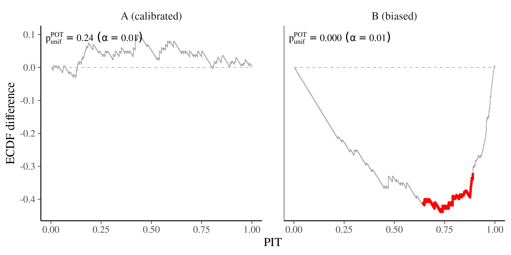

All correlated-method arguments (`test`, `gamma`, `linewidth`, `color`,
`help_text`, `help_text_shrinkage`, `pareto_pit`) work the same way as
in
[`ppc_pit_ecdf()`](https://mc-stan.org/bayesplot/dev/reference/PPC-distributions.md).
In faceted plots, a smaller `help_text_shrinkage` is often helpful so
annotations do not dominate the panels.

## Using `brms::pp_check()`

It is also possible to use `brms::pp_check()` with
`type = "loo_pit_ecdf"` to perform the same testing and plotting
procedure as
[`ppc_loo_pit_ecdf()`](https://mc-stan.org/bayesplot/dev/reference/PPC-loo.md).
The following code snippet provides an example:

``` r

brms::pp_check(
  fit_normal,
  type = "loo_pit_ecdf",
  method = "correlated"
)
```

## Case Studies

Several case studies on the companion website for *Bayesian Workflow*
(Gelman et al., [2026](#Gelman2026)) illustrate how to use the updated
functions:

- [Roaches cross-validation model checking and
  comparison](https://users.aalto.fi/~ave/_site/roaches/roaches.html)
- [Nabiximols treatment
  efficiency](https://users.aalto.fi/~ave/_site/nabiximols/nabiximols.html)
- [Sleep study: Prior specification and model
  checking](https://users.aalto.fi/~ave/_site/sleep_study/sleep_study.html)
- [World Cup continuous vs discrete
  models](https://users.aalto.fi/~ave/_site/world_cup/world_cup.html)

## Summary of new arguments

| Argument | Values | Default |
|----|----|----|
| `method` | `"independent"`, `"correlated"` | `NULL` → falls back to `"independent"` with a deprecation notice |
| `test` | `"POT"`, `"PRIT"`, `"PIET"` | `"POT"` |
| `gamma` | numeric \\\ge 0\\ | `0` |
| `linewidth` | numeric | `0.3` |
| `color` | named character vector | `c(ecdf = "grey60", highlight = "red")` |
| `help_text` | `TRUE`, `FALSE` | `TRUE` |
| `help_text_shrinkage` | numeric in \\(0, 1\]\\ | `0.8` |
| `pareto_pit` | `TRUE`, `FALSE` | `TRUE` if `test` is `"POT"` or `"PIET"` and no `pit` supplied; `FALSE` otherwise |

## References

Gelman, A., Vehtari, A., McElreath, R., Simpson, D., Margossian, C.,
Yao, Y., Kennedy, L., Gabry, J., Burkner, P.-C., Modrak, M., & Leos
Barajas, V. (2026). Bayesian Workflow. Routledge.
<https://www.routledge.com/Bayesian-Workflow/Gelman-Vehtari-McElreath-Simpson-Margossian-Yao-Kennedy-Gabry-Burkner-Modrak-Barajas/p/book/9780367490140>

Säilynoja, T., Bürkner, P.-C., and Vehtari, A. (2022). Graphical test
for discrete uniformity and its applications in goodness-of-fit
evaluation and multiple sample comparison. *Statistics and Computing*,
32, 32. <https://link.springer.com/10.1007/s11222-022-10090-6>

Tesso, H., & Vehtari, A. (2026). LOO-PIT predictive model checking.
<http://arxiv.org/abs/2603.02928>

Vehtari, A., Gelman, A., and Gabry, J. (2017). Practical Bayesian model
evaluation using leave-one-out cross-validation and WAIC. *Statistics
and Computing*, 27(5), 1413–1432.
<https://link.springer.com/article/10.1007/S11222-016-9696-4>

Vehtari, A., Simpson, D., Gelman, A., Yao, Y., and Gabry, J. (2024).
Pareto smoothed importance sampling. *Journal of Machine Learning
Research*, 25(72), 1–58. <https://www.jmlr.org/papers/v25/19-556.html>
