# PPC Calibration - Calibration of Bayesian models with binary outcomes

``` r

library(brms)
library(dplyr)
library(rstanarm)
library(ggplot2)
library(patchwork)

SEED <- 840
set.seed(SEED)
```

## Overview

This vignette introduces the **PPC calibration** family of functions in
`bayesplot`, which assess the calibration of Bayesian models with binary
outcomes by examining the agreement between predicted probabilities and
observed event rates.

A model is *well-calibrated* when its predicted probabilities match
empirical event frequencies. For example, among all observations where
the model assigns a 30% probability, roughly 30% of events should
actually occur. Deviations from this pattern signal systematic over- or
underprediction.

This vignette explains the underlying methodology, walks through the
core plotting functions and their customization options, and showcases
the use of calibration plots in a real-world example.

## Methodological Background

### Conditional Event Probabilities (CEP)

Following Dimitriadis, Gneiting, and Jordan (2021), `bayesplot`
estimates the Conditional Event Probability (CEP), defined as the true
underlying probability of an event given the model-assigned predicted
probability \\p\\.

Formally, if the model predicts \\p\\ for an observation, the CEP
answers: *“Among all observations that received this prediction, what
fraction actually had the event?”*

A perfectly calibrated model has a CEP function equal to the identity,
that is, CEP(\\p\\) = \\p\\ for all \\p\\. When plotted, this produces a
45-degree diagonal reference line. Deviations from the diagonal reveal
miscalibration.

### Estimating the CEP: the PAV Algorithm

To estimate the CEP from data, `bayesplot` uses the **Pool Adjacent
Violators (PAV)** algorithm (Ayer et al., 1955). For more details see
Dimitriadis et al. (2021) and Säilynoja et al. (2025). The PAV algorithm
solves an isotonic regression problem: it finds the monotone
non-decreasing step function that best fits the binary outcomes as a
function of the ordered predicted probabilities.

The estimation procedure has three steps which are described below and
illustrated with a toy example consisting of 8 observations with their
predicted probabilities \\p_i\\ and binary outcomes \\y_i\\ for \\i = 1,
\ldots, 8\\.

#### Step 1: Sort by predicted probability

Order observations by their predicted probability.

``` r

df_toy <- data.frame(
  p = c(0.05, 0.10, 0.20, 0.30, 0.45, 0.60, 0.75, 0.90),
  y = c(0,    0,    1,    0,    1,    1,    0,    1)
)
df_toy
#>      p y
#> 1 0.05 0
#> 2 0.10 0
#> 3 0.20 1
#> 4 0.30 0
#> 5 0.45 1
#> 6 0.60 1
#> 7 0.75 0
#> 8 0.90 1
```

#### Step 2: Fit a monotone step function with PAV

Apply the PAV algorithm to the ordered outcomes. The result is a
piecewise- constant, non-decreasing estimate of the CEP at each
predicted probability \\p_i\\.

``` r

df_toy <- df_toy |>
  dplyr::mutate(cep = round(stats::isoreg(df_toy$y)$yf, 2))
df_toy
#>      p y  cep
#> 1 0.05 0 0.00
#> 2 0.10 0 0.00
#> 3 0.20 1 0.50
#> 4 0.30 0 0.50
#> 5 0.45 1 0.67
#> 6 0.60 1 0.67
#> 7 0.75 0 0.67
#> 8 0.90 1 1.00
```

#### Step 3: Plot CEP against predicted probability

Plot the estimated step function with predicted probabilities \\p_i\\ on
the x-axis and CEP on the y-axis. The diagonal reference line marks
perfect calibration.

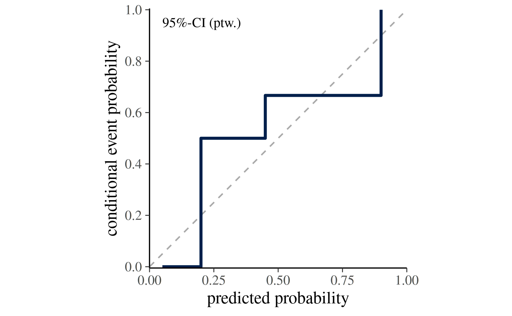

Dimitriadis et al. (2021) estimate CEP using point estimates of the
probabilities (i.e., one probability per binary observation) as
implemented in the `reliabilitydiag` package. For a fitted Bayesian
model, the CEP is estimated for each posterior draw separately based on
the predicted probabilities from the posterior predictive distribution.
In the following code block we adjust the toy example by simulating
\\S=100\\ draws of predicted probabilities for each observation.

``` r

S <- 100
N <- length(df_toy$y)

# simulate a matrix of predicted probabilities of dimension S x N
prep <- t(replicate(S, pmin(pmax(df_toy$p + rnorm(N, 0, 0.08), 0), 1)))

df_toy_draws <- list(p = prep, y = df_toy$y)
```

The calibration curve can then be plotted for each draw using
[`ppc_calibration_overlay()`](https://mc-stan.org/bayesplot/dev/reference/PPC-calibration.md).
The resulting plot shows the draw-to-draw variability in the calibration
curve.

Alternatively,
[`ppc_calibration()`](https://mc-stan.org/bayesplot/dev/reference/PPC-calibration.md)
can be used to summarize the draw-specific curves into a single
calibration curve with an uncertainty band. The next section explains
how the uncertainty intervals are constructed.

``` r

ppc_calibration(y = df_toy$y, prep = df_toy_draws$p, show_qdots = FALSE)
```

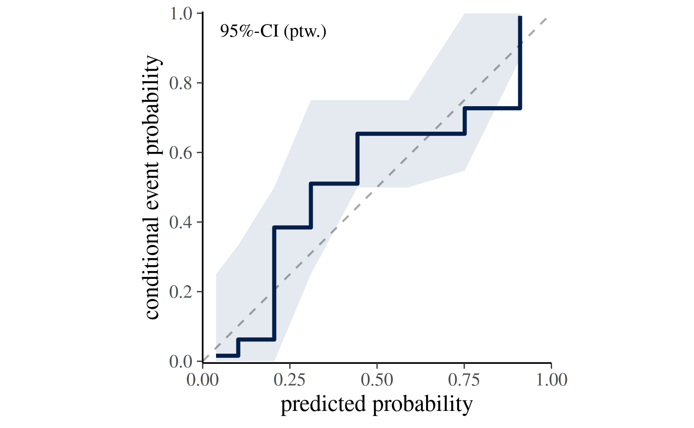

### Uncertainty Intervals

[`ppc_calibration()`](https://mc-stan.org/bayesplot/dev/reference/PPC-calibration.md)
summarizes the draw-specific curves into a single calibration curve with
an uncertainty band. The plotting function supports two strategies for
propagating uncertainty via the `interval` argument.

#### Estimation uncertainty (`interval = "confidence"`):

The default setting `interval = "confidence"` answers the question:
*Where does the calibration curve of our model lie?*. It reflects the
uncertainty in the CEP induced by variation across posterior draws.

If posterior probability draws are provided via `prep`, the confidence
band is constructed as follows:

1.  For each posterior draw \\s\\, sort observations \\y_i\\ by
    posterior predictions \\p_i^{(s)}\\.
2.  Estimate for each posterior draw a CEP curve.
3.  Take pointwise quantiles of the draw-specific CEP values across all
    \\S\\ draws (e.g., 2.5% and 97.5% for `prob = 0.95`) to form the
    ribbon.

The central step curve is the pointwise posterior mean of the
draw-specific curves.

In the
[`ppc_calibration()`](https://mc-stan.org/bayesplot/dev/reference/PPC-calibration.md)
plot, this interval type is labeled `95%-CI (ptw.)`, indicating a
pointwise confidence interval for the CEP curve whose bounds are the
2.5% and 97.5% quantiles of the draw-specific CEP curves. The
probability can be adjusted with the `prob` argument.

If posterior predictions are provided via `yrep`, the confidence band is
constructed by bootstrapping the observed data and re-estimating the CEP
curve for each bootstrap sample.

#### Posterior predictive consistency (`interval = "consistency"`)

The setting `interval = "consistency"` answers the question: *If the
model is correctly specified, where would we expect the calibration
curve to fall?* The band is constructed as follows:

1.  For each draw \\s\\ and its sorted posterior predictions
    \\p_i^{(s)}\\, simulate replicated outcomes \\\tilde{y}\_i^{(s)}
    \sim \mathrm{Bernoulli}(p_i^{(s)})\\.
2.  Estimate for each replicated outcome a CEP curve.
3.  Take pointwise quantiles of the CEP values across all \\S\\ draws to
    form the ribbon.

The central curve is still estimated from the *observed* outcomes. If
the observed curve falls outside the consistency band, the model is
self-**in**consistent, that is, its predictions do not match the
data-generating distribution it implies.

In the
[`ppc_calibration()`](https://mc-stan.org/bayesplot/dev/reference/PPC-calibration.md)
plot, this interval type is labeled `95%-CsI (ptw.)`, indicating a
pointwise consistency interval for the CEP curve whose bounds are the
2.5% and 97.5% quantiles of the draw-specific CEP curves. The
probability can be adjusted with the `prob` argument.

The following figure shows for the toy example the calibration curve
with both types of intervals. The confidence band (left) reflects the
uncertainty in the CEP curve based on posterior variability and the
consistency band (right) reflects where the calibration curve is
expected to lie if the model is calibrated.

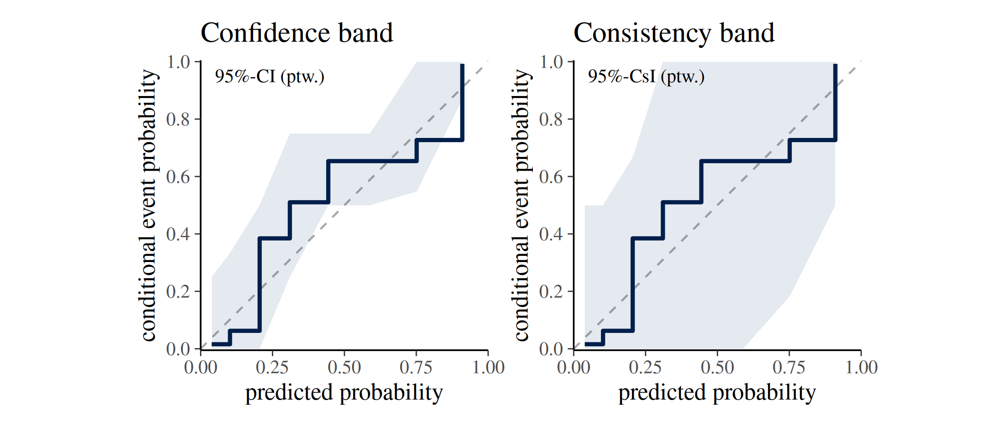

### Calibrated vs. Miscalibrated: an Illustration

The following figure contrasts a calibrated and a miscalibrated model
fitted to simulated data, and demonstrates the interpretation of the
diagonal reference line introduced above.

We simulate \\n=600\\ observations of a single predictor \\x \sim
N(0,1)\\ and generate two binary outcomes.

- The **calibrated** outcome follows a logistic model linear in \\x\\,
  so the same linear model fitted by
  [`brm()`](https://paulbuerkner.com/brms/reference/brm.html) is
  correctly specified and its predictions should align with the observed
  event rates.

- The **miscalibrated** outcome is generated from a model that also
  includes a quadratic term \\0.9 \times x^2\\, which the fitted linear
  model cannot capture; this systematic misspecification causes the
  predicted probabilities to diverge from the true event rates.

Both models share the same weakly informative priors and are fitted with
a single chain for illustration purposes.

``` r

n <- 600

x <- rnorm(n)
y <- rbinom(n, size = 1, prob = plogis(-0.5 + 1.2 * x))
y_mis <- rbinom(n, size = 1, prob = plogis(-0.5 + 1.2 * x + 0.9 * x^2))

df <- data.frame(y = y, x = x)
df_mis <- data.frame(y = y_mis, x = x)

fit_model <- function(df, seed) {
  brm(
    formula = y ~ x,
    data = df,
    family = bernoulli(link = "logit"),
    prior = c(
      prior(normal(0, 2.5), class = "b"),
      prior(normal(0, 5), class = "Intercept")
    ),
    chains = 1,
    seed = seed,
    refresh = 0
  )
}

fit_calib <- fit_model(df, SEED)
fit_miscalib <- fit_model(df_mis, SEED)

prep <- posterior_epred(fit_calib)
prep_mis <- posterior_epred(fit_miscalib)

yrep <- posterior_predict(fit_calib)
yrep_mis <- posterior_predict(fit_miscalib)
```

While the curve in the calibrated model (left) tracks the diagonal
closely, the miscalibrated model (right) shows a systematic deviation
from the diagonal reference line.

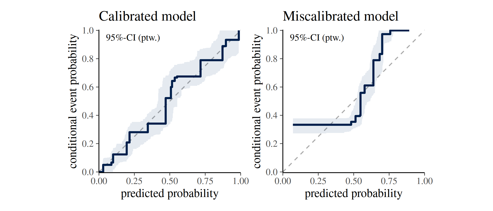

## Overview of ppc-calibration functions and customization options

In the following an overview of the core `ppc_calibration` functions is
provided, along with explanations of their input arguments and
customization options.

### `ppc_calibration_data()` — the underlying data structure

[`ppc_calibration_data()`](https://mc-stan.org/bayesplot/dev/reference/PPC-calibration.md)
computes the data that the `ppc_calibration` plots are built on.
Understanding its output helps to work with or extend the visualisations
or to build custom calibration plots.

The `type` argument controls the type of data returned. Setting
`type = "overlay"` returns the data for the draw-specific curves
displayed in
[`ppc_calibration_overlay()`](https://mc-stan.org/bayesplot/dev/reference/PPC-calibration.md)
and its `_grouped` variant. It has a row for each observation and
posterior draw, so the number of rows equals \\N \times S\\ where \\N\\
is the number of observations and \\S\\ is the number of posterior
draws.

``` r

dat <- ppc_calibration_data(y = y, prep = prep, type = "overlay")
print(head(dat, 5))
#> # A tibble: 5 × 5
#>   group  y_id rep_id   value   cep
#>   <dbl> <int>  <int>   <dbl> <dbl>
#> 1     1   311      1 0.00199     0
#> 2     1   311      2 0.00323     0
#> 3     1   311      3 0.00146     0
#> 4     1   311      4 0.00169     0
#> 5     1   311      5 0.00566     0

paste("nrow:", nrow(dat))
#> [1] "nrow: 600000"
```

While `type = "interval"` returns the data format underlying
[`ppc_calibration()`](https://mc-stan.org/bayesplot/dev/reference/PPC-calibration.md)
and its `_grouped` and `_loo` variants. This data frame has a row for
each observation, so the number of rows equals \\N\\ and the data are
aggregated across posterior draws to form the uncertainty interval.

``` r

dat2 <- ppc_calibration_data(y = y, prep = prep, type = "interval")
print(head(dat2, 5))
#> # A tibble: 5 × 6
#>   group  y_id   value   cep    lb    ub
#>   <dbl> <int>   <dbl> <dbl> <dbl> <dbl>
#> 1     1     1 0.00341     0     0     0
#> 2     1     2 0.00713     0     0     0
#> 3     1     3 0.00999     0     0     0
#> 4     1     4 0.0106      0     0     0
#> 5     1     5 0.0158      0     0     0

paste("nrow:", nrow(dat2))
#> [1] "nrow: 600"
```

The data structure of both types is a long-format data frame with
columns `group`, `y_id`, `value`, and `cep`. For `type = 'overlay'` an
additional column `rep_id` is included reflecting the posterior draw
index and for `type = 'interval'` additional columns `lb` and `ub` are
included for the lower and upper bounds of the uncertainty interval.

A short description of the columns is provided in the following table:

| Column | Description |
|----|----|
| `group` | Group label; if `group = NULL`, all observations belong to one group. (factor or double) |
| `y_id` | Observation index (\\i = 1, \ldots, n_z\\ within group \\z\\). (integer) |
| `value` | Sorted predicted probabilities \\p_i^{(s)}\\. (double) |
| `cep` | Conditional event probability \\cep_i^{(s)}\\. (double) |
| `rep_id` | `type = 'overlay'`: Posterior draw index (\\s = 1, \ldots, S\\). (integer) |
| `lb` | `type = 'interval'`: Lower bound of the uncertainty interval. (double) |
| `ub` | `type = 'interval'`: Upper bound of the uncertainty interval. (double) |

### `ppc_calibration_overlay()` — one curve per posterior draw

[`ppc_calibration_overlay()`](https://mc-stan.org/bayesplot/dev/reference/PPC-calibration.md)
draws one calibration curve per posterior draw, making it a useful tool
for exploring the variability in calibration across posterior draws.

In the following we use the simulated data from the previous section to
compare the draw-specific calibration curves of the calibrated and
miscalibrated models. The plot shows that the curves from the calibrated
model (left) cluster around the diagonal reference line, while those
from the miscalibrated model (right) deviate from it for lower predicted
probabilities.

``` r

p1 <- ppc_calibration_overlay(y = y, prep = prep) +
  labs(title = "Calibrated")

p2 <- ppc_calibration_overlay(y = y, prep = prep_mis) +
  labs(title = "Miscalibrated")

p1 + p2
```

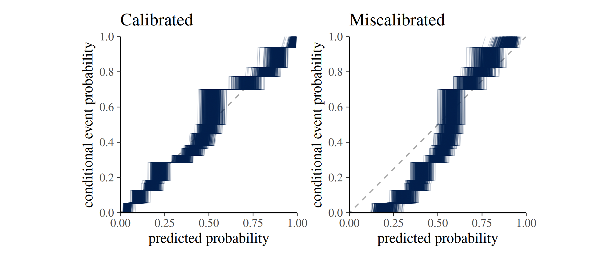

#### Grouped data

When observations belong to subgroups,
[`ppc_calibration_overlay_grouped()`](https://mc-stan.org/bayesplot/dev/reference/PPC-calibration.md)
produces a faceted plot.

For illustration, we define for our simulated data a grouping variable
by assigning the first half of the simulated observations to group A and
the second half to group B.

``` r

group <- rep(c("A", "B"), each = n / 2)

ppc_calibration_overlay_grouped(y = y, prep = prep, group = group)
```

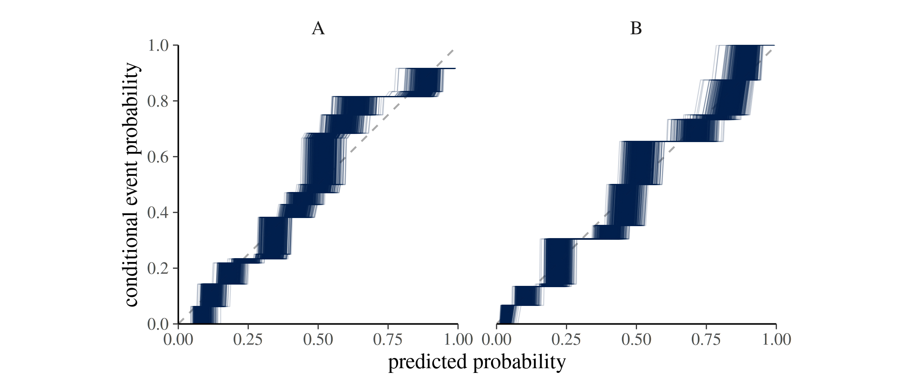

### `ppc_calibration()` — calibration curve with uncertainty bands

[`ppc_calibration()`](https://mc-stan.org/bayesplot/dev/reference/PPC-calibration.md)
is the main plotting function. It displays the calibration curve
together with an uncertainty band. The meaning of the band depends on
the `interval` argument (as discussed above).

#### Expected input arguments

[`ppc_calibration()`](https://mc-stan.org/bayesplot/dev/reference/PPC-calibration.md)
expects the following input arguments:

- **Core data**
  - **`y`**: numeric vector of observed outcomes of length `N`, no `NA`,
    with values in `[0, 1]` (typically binary `0/1`).
  - Exactly one of:
    - **`prep`**: numeric `S x N` matrix of predicted probabilities in
      `[0, 1]`, no `NA`, where `S` refers to the number of posterior
      draws.
    - **`yrep`**: numeric `S x N` matrix of posterior predictive draws,
      no `NA` (typically binary draws), where `S` refers to the number
      of posterior draws.
  - `ncol(prep)` or `ncol(yrep)` must equal `length(y)`.
- **Interval controls**
  - **`prob`**: a single value strictly between `0` and `1`.
  - **`interval`**: one of `"confidence"` or `"consistency"`.
  - **`B`**: if `interval = "consistency"`: positive integer indicating
    number of bootstrap samples.
- **Plot controls**
  - **`help_text`**: whether label (e.g., `95%-CI (ptw.)`) is shown.
  - **`show_mean`**: logical; whether the mean calibration curve is
    shown.
  - **`show_qdots`**: logical; whether the marginal distribution of
    predicted probabilities is shown as a quantile dot plot along the
    x-axis.
  - **`qdots_quantiles`**: positive integer; number of quantiles to
    display in the quantile dot plot (only if `show_qdots = TRUE`).
- **Styling**
  - **`linewidth`**, **`alpha`**: passed to ggplot geoms.

Because the function signature is
`ppc_calibration(y, prep = NULL, yrep = NULL, ...)`, an unnamed second
matrix argument is interpreted as `prep`. Use `yrep = ...` explicitly
when supplying posterior predictive draws.

#### `interval` and `prob` — uncertainty intervals

The `interval` argument controls the type of uncertainty interval
displayed in the plot. The `prob` argument controls the width of the
interval (e.g., `0.95` for a 95% interval). See the section on
[Uncertainty Intervals](#uncertainty-intervals) above for details.

The following plot shows the calibration curves for the simulated
calibrated and miscalibrated models, with both confidence intervals (top
row) and consistency intervals (bottom row).

``` r


p1 <- ppc_calibration(y = y, yrep = yrep) +
  labs(title = "Calibrated model")

p2 <- ppc_calibration(y = y, yrep = yrep_mis) +
  labs(title = "Miscalibrated model")

p3 <- ppc_calibration(y = y, yrep = yrep, interval = "consistency")

p4 <- ppc_calibration(y = y, yrep = yrep_mis, interval = "consistency")

p1 + p2 + p3 + p4 + plot_layout(ncol = 2)
```

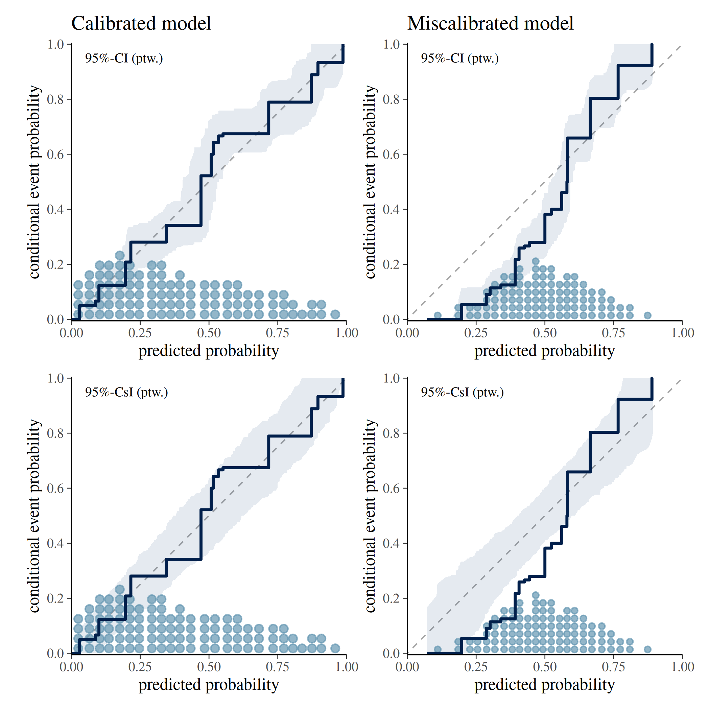

#### `show_qdots` and `qdots_quantiles` — quantile dot plot

Setting `show_qdots = TRUE` overlays a quantile dot plot along the
x-axis, showing the marginal distribution of predicted probabilities.
Each dot represents an empirical quantile. By default
`qdots_quantiles = 100` dots are displayed. See Säilynoja et al. (2025)
for methodological details.

The following plot shows the calibration curves for the simulated
calibrated and miscalibrated models, with quantile dot plots along the
x-axis showing the distribution of predicted probabilities. The top row
shows 100 quantiles, while the bottom row shows 300 quantiles.

``` r

p1 <- ppc_calibration(y = y, yrep = yrep) +
  labs(title = "Calibrated model \n # qdots = 100")

p2 <- ppc_calibration(y = y, yrep = yrep_mis) +
  labs(title = "Miscalibrated model \n # qdots = 100")

p3 <- ppc_calibration(y = y, yrep = yrep, qdots_quantiles = 300) +
  labs(title = "# qdots = 300")

p4 <- ppc_calibration(y = y, yrep = yrep_mis, qdots_quantiles = 300) +
  labs(title = "# qdots = 300")

p1 + p2 + p3 + p4 + plot_layout(ncol = 2)
```

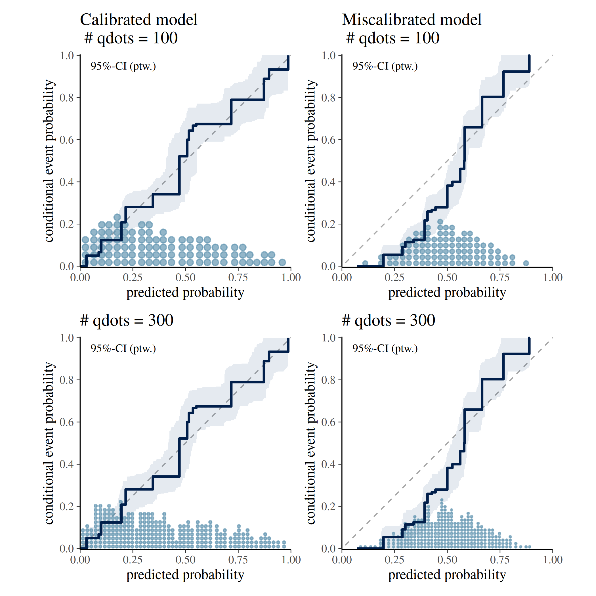

#### `help_text` — interpretive caption

A short caption appears in the plot by default (`help_text = TRUE`)
which provides information about the interval type and probability. This
is intended to help users interpret the plot correctly. It can be
suppressed by setting `help_text = FALSE`.

The following plot shows the calibration curve for the simulated
calibrated model with and without the interpretive caption.

``` r

p1 <- ppc_calibration(y = y, yrep = yrep, help_text = TRUE)

p2 <- ppc_calibration(y = y, yrep = yrep, help_text = FALSE)

p1 | p2
```

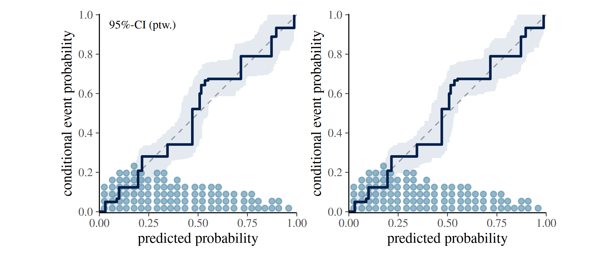

### `ppc_loo_calibration()` — LOO-adjusted calibration curve

[`ppc_loo_calibration()`](https://mc-stan.org/bayesplot/dev/reference/PPC-calibration.md)
is a variant of
[`ppc_calibration()`](https://mc-stan.org/bayesplot/dev/reference/PPC-calibration.md)
that incorporates importance weights from a leave-one-out (LOO)
analysis. Weights can be provided directly via the `lw` argument;
alternatively, a `psis_object` can be passed and the weights will be
computed internally.

As with
[`ppc_calibration()`](https://mc-stan.org/bayesplot/dev/reference/PPC-calibration.md),
a grouped version
[`ppc_loo_calibration_grouped()`](https://mc-stan.org/bayesplot/dev/reference/PPC-calibration.md)
is available that produces a faceted plot when a grouping variable is
supplied.

## Real-World Example: Modelling Roach Infestation

The following example is drawn from Säilynoja et al. (2025) and uses the
`roaches` dataset from `rstanarm`. The data records the number of
roaches caught in traps across 264 apartments assigned to a treatment or
control condition. We compare two count-data models for the binary
outcome “at least one roach observed”:

- A **negative binomial** model (fitted with
  [`rstanarm::stan_glm()`](https://mc-stan.org/rstanarm/reference/stan_glm.html)).
- A **zero-inflated negative binomial** model (fitted with
  [`brms::brm()`](https://paulbuerkner.com/brms/reference/brm.html)).

For a complete Bayesian workflow using this dataset see also Aki
Vehtari’s case study [*Roaches cross-validation model checking and
comparison*](https://users.aalto.fi/~ave/casestudies/roaches/roaches.html).

``` r

SEED <- 840
data(roaches, package = "rstanarm")

roaches$sqrt_roach1 <- sqrt(roaches$roach1)
n <- length(roaches$y)

brm_glmzinb <- brms::brm(
  formula = brms::bf(
    y ~ sqrt_roach1 + treatment + senior + offset(log(exposure2)),
    zi ~ sqrt_roach1 + treatment + senior + offset(log(exposure2))
  ),
  family = brms::zero_inflated_negbinomial(),
  data = roaches,
  prior = c(
    brms::prior(normal(0, 3), class = "b"),
    brms::prior(normal(0, 3), class = "b", dpar = "zi"),
    brms::prior(normal(0, 3), class = "Intercept", dpar = "zi")
  ),
  seed = SEED,
  refresh = 0,
  silent = 2
)

stan_glmnb <- rstanarm::stan_glm(
  formula = y ~ sqrt_roach1 + treatment + senior,
  offset = log(exposure2),
  data = roaches,
  family = neg_binomial_2,
  prior = normal(0, 2.5),
  prior_intercept = normal(0, 5),
  chains = 4,
  cores = 1,
  seed = SEED,
  refresh = 0
)
```

### Confidence intervals for estimation uncertainty

Interpretation of uncertainty interval: Where do we expect our model’s
calibration curve to lie?

``` r

pp_nb <- pmin(brms::posterior_predict(stan_glmnb), 1)
pp_zinb <- apply(brms::posterior_predict(brm_glmzinb), 2, pmin, 1)

p1 <- ppc_calibration(
  y = pmin(roaches$y, 1),
  yrep = pp_nb,
  interval = "confidence",
  prob = 0.95
) +
  labs(title = "Negative binomial")

p2 <- ppc_calibration(
  y = pmin(roaches$y, 1),
  yrep = pp_zinb,
  interval = "confidence",
  prob = 0.95
) +
  labs(title = "Zero-inflated negative binomial")

p1 + p2
```

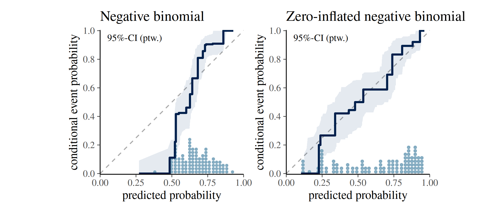

### Consistency intervals for model checking

Interpretation of uncertainty interval: Where would the calibration
curve of a calibrated model lie?

``` r

p1 <- ppc_calibration(
  y = pmin(roaches$y, 1),
  yrep = pp_nb,
  interval = "consistency",
  prob = 0.95
) +
  labs(title = "Negative binomial")

p2 <- ppc_calibration(
  y = pmin(roaches$y, 1),
  yrep = pp_zinb,
  interval = "consistency",
  prob = 0.95
) +
  labs(title = "Zero-inflated negative binomial")

p1 + p2
```

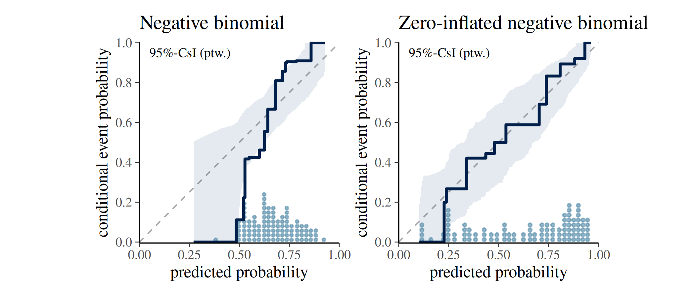

The
[`ppc_calibration()`](https://mc-stan.org/bayesplot/dev/reference/PPC-calibration.md)
plot indicates that the **negative binomial** model is underconfident
when predicting zero-roach outcomes: its calibration curve falls outside
the consistency band, revealing a mismatch between predicted and
observed event rates.

The **zero-inflated** model’s curve stays within the band and spans a
wider range of predicted probabilities, reflecting both better
calibration and stronger discrimination between apartments with and
without roaches.

### LOO calibration

[`ppc_loo_calibration()`](https://mc-stan.org/bayesplot/dev/reference/PPC-calibration.md)
uses the `brm_glmzinb` object fitted above. The PSIS object is computed
from it and then passed alongside the standard arguments. The comparison
below shows the in-sample calibration curve (left) and the LOO-adjusted
curve (right) for the negative binomial model.

``` r

brm_glmzinb <- brms::add_criterion(brm_glmzinb, criterion = "loo")
#> Warning: Found 1 observations with a pareto_k > 0.7 in model 'brm_glmzinb'. We
#> recommend to set 'moment_match = TRUE' in order to perform moment matching for
#> problematic observations.
fit_glmzinb_loo <- brms::loo(brm_glmzinb, save_psis = TRUE)
#> Recomputing 'loo' for model 'brm_glmzinb'
#> Warning: Found 1 observations with a pareto_k > 0.7 in model 'brm_glmzinb'. We
#> recommend to set 'moment_match = TRUE' in order to perform moment matching for
#> problematic observations.

p1 <- ppc_calibration(
  y = pmin(roaches$y, 1),
  yrep = pp_nb,
  interval = "consistency",
  prob = 0.95
) +
  labs(title = "Negative binomial")

p2 <- ppc_loo_calibration(
  y = pmin(roaches$y, 1),
  yrep = pp_nb,
  psis_object = fit_glmzinb_loo$psis_object,
  interval = "consistency",
  prob = 0.95
) +
  labs(title = "Negative binomial (LOO)")

p1 + p2
```

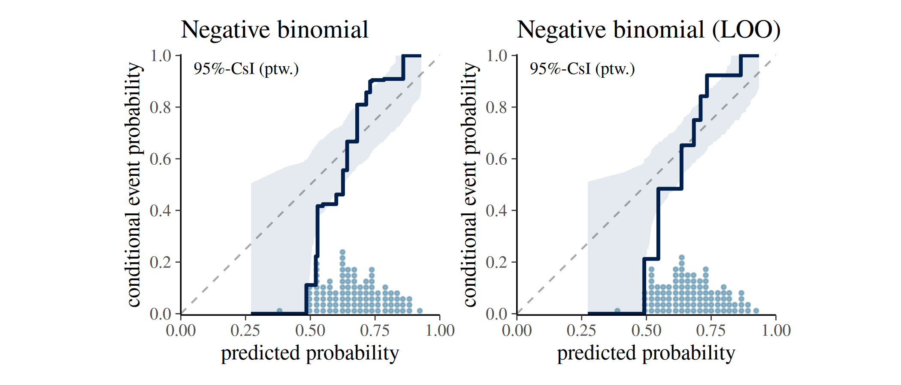

## References

- Ayer, M., Brunk, H. D., Ewing, G. M., Reid, W. T., & Silverman, E.
  (1955). An empirical distribution function for sampling with
  incomplete information. *Annals of Mathematical Statistics*, 26(4),
  641–647.

- Dimitriadis, T., Gneiting, T., & Jordan, A. I. (2021). Stable
  reliability diagrams for probabilistic classifiers. *Proceedings of
  the National Academy of Sciences*, 118(8).
  <https://doi.org/10.1073/pnas.2016191118>

- Säilynoja, T., Johnson, A. R., Martin, O. A., & Vehtari, A. (2025).
  Recommendations for visual predictive checks in Bayesian workflow.
  (Preprint). *arXiv*. <https://doi.org/10.48550/arXiv.2503.01509>
