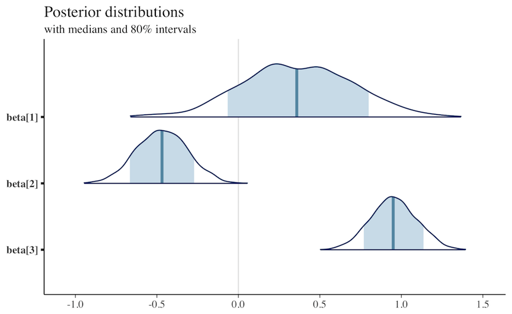
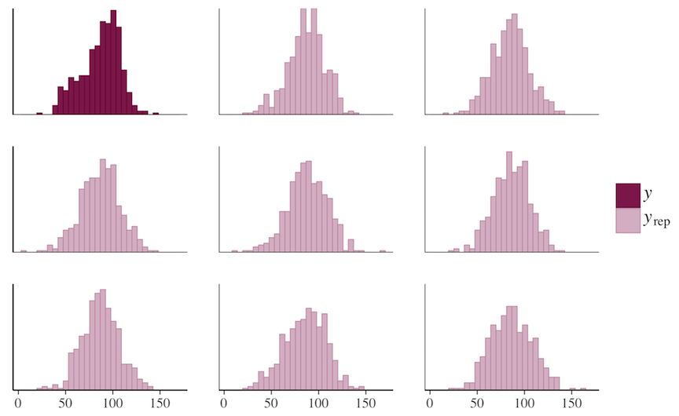
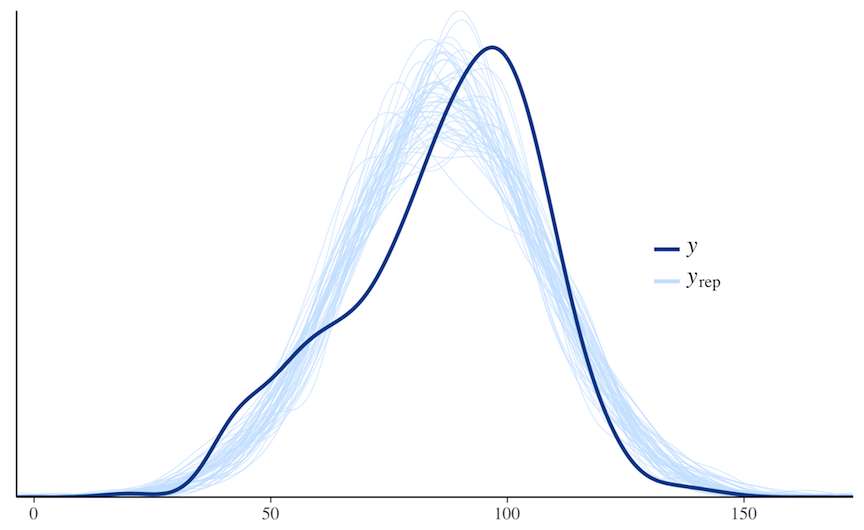

# **bayesplot**: Plotting for Bayesian Models

*Stan Development Team*

The **bayesplot** package provides a variety of **ggplot2**-based
plotting functions for use after fitting Bayesian models (typically,
though not exclusively, via Markov chain Monte Carlo). The package is
designed not only to provide convenient functionality for users, but
also a common set of functions that can be easily used by developers
working on a variety of packages for Bayesian modeling, particularly
(but not necessarily) packages powered by RStan (the R interface to
Stan). Examples of packages that will soon (or already are) using
**bayesplot** are **rstan** itself, as well as the **rstan**-dependent
**rstanarm** and **brms** packages for applied regression modeling.

## Plotting functionality



The plotting functions in **bayesplot** are organized into several
modules:

- [MCMC](https://mc-stan.org/bayesplot/dev/reference/MCMC-overview.md):
  Visualizations of Markov chain Monte Carlo (MCMC) simulations
  generated by *any* MCMC algorithm as well as diagnostics. There are
  also additional functions specifically for use with models fit using
  the [No-U-Turn Sampler
  (NUTS)](https://mc-stan.org/bayesplot/dev/reference/MCMC-nuts.md).

- [PPC](https://mc-stan.org/bayesplot/dev/reference/PPC-overview.md):
  Graphical (posterior or prior) predictive checks (PPCs).

- [PPD](https://mc-stan.org/bayesplot/dev/reference/PPD-overview.md):
  Plots of (posterior or prior) predictive distributions without
  comparisons to observed data.

## Resources

- **Online documentation and vignettes**: Visit the **bayesplot**
  website at <https://mc-stan.org/bayesplot/>

- **Bug reports and feature requests**: If you would like to request a
  new feature or if you have noticed a bug that needs to be fixed please
  let us know at the **bayesplot** issue tracker at
  <https://github.com/stan-dev/bayesplot/issues/>

- **General questions and help**: To ask a question about **bayesplot**
  on the Stan Forums forum please visit <https://discourse.mc-stan.org>.

## References

Gabry, J. , Simpson, D. , Vehtari, A. , Betancourt, M. and Gelman, A.
(2019), Visualization in Bayesian workflow. *J. R. Stat. Soc. A*, 182:
389-402. doi:10.1111/rssa.12378. ([journal
version](https://rss.onlinelibrary.wiley.com/doi/full/10.1111/rssa.12378),
[arXiv preprint](https://arxiv.org/abs/1709.01449), [code on
GitHub](https://github.com/jgabry/bayes-vis-paper))

## See also

[`theme_default()`](https://mc-stan.org/bayesplot/dev/reference/theme_default.md)
for the default ggplot theme used by **bayesplot** and
[`bayesplot_theme_set()`](https://mc-stan.org/bayesplot/dev/reference/bayesplot_theme_get.md)
to change it.

[bayesplot-colors](https://mc-stan.org/bayesplot/dev/reference/bayesplot-colors.md)
to set or view the color scheme used for plotting.

[`ggplot2::ggsave()`](https://ggplot2.tidyverse.org/reference/ggsave.html)
for saving plots.

## Author

**Maintainer**: Jonah Gabry <jsg2201@columbia.edu>

Authors:

- Tristan Mahr ([ORCID](https://orcid.org/0000-0002-8890-5116))

Other contributors:

- Paul-Christian Bürkner \[contributor\]

- Martin Modrák \[contributor\]

- Malcolm Barrett \[contributor\]

- Frank Weber \[contributor\]

- Eduardo Coronado Sroka \[contributor\]

- Teemu Sailynoja \[contributor\]

- Aki Vehtari \[contributor\]

- Behram Ulukır \[contributor\]

## Examples

``` r
# A few quick examples (all of the functions have many examples
# on their individual help pages)

# MCMC plots
x <- example_mcmc_draws(params = 5)
mcmc_intervals(x, prob = 0.5)

mcmc_intervals(x, regex_pars = "beta")


color_scheme_set("purple")
mcmc_areas(x, regex_pars = "beta", prob = 0.8)


color_scheme_set("mix-blue-red")
mcmc_trace(x, pars = c("alpha", "sigma"),
           facet_args = list(nrow = 2))


color_scheme_set("brightblue")
mcmc_scatter(x, pars = c("beta[1]", "sigma"),
             transformations = list(sigma = "log"))


# Graphical PPCs
y <- example_y_data()
yrep <- example_yrep_draws()
ppc_dens_overlay(y, yrep[1:50, ])

# \donttest{
color_scheme_set("pink")
ppc_stat(y, yrep, stat = "median") + grid_lines()
#> `stat_bin()` using `bins = 30`. Pick better value `binwidth`.

ppc_hist(y, yrep[1:8, ])
#> `stat_bin()` using `bins = 30`. Pick better value `binwidth`.


# Same plots but without y (using ppd_ instead of ppc_)
bayesplot_theme_set(ggplot2::theme_gray())
ypred <- yrep
ppd_dens_overlay(ypred[1:50, ])

ppd_stat(ypred, stat = "median") + grid_lines()
#> `stat_bin()` using `bins = 30`. Pick better value `binwidth`.

ppd_hist(ypred[1:8, ])
#> `stat_bin()` using `bins = 30`. Pick better value `binwidth`.

# }
```
